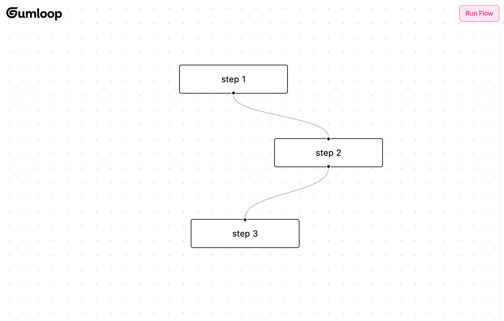

# Gumloop Coding Challenge

👋

This is an open-ended challenge. The general goal is to make the flow do something useful when you click the 'Run Flow' button. It's totally up to you how simple or complex you want to make it.

Feel free to set things up however you want. Honestly feel free to not even use this repo and start from scratch if you'd like.

Also check out [react flow here](https://reactflow.dev/), it's an awesome project.

## Getting Started

1. Clone this repository

2. Install dependencies:

```bash
npm install # or `pnpm install` or `yarn install`
```

3. Start the development server:

```bash
npm run dev
```

## Submission

Include a link to your repo in your submission or give https://github.com/rbehal access. Email us at founders@gumloop.com if you have any issues.
